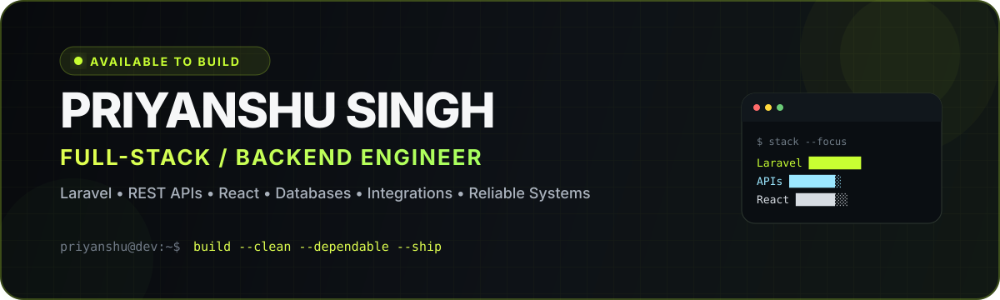

<p align="center">
  <picture>
    <source media="(prefers-color-scheme: dark)" srcset="./assets/profile-hero-dark.svg" />
    <source media="(prefers-color-scheme: light)" srcset="./assets/profile-hero-light.svg" />
    
  </picture>
</p>

<p align="center">
  <a href="https://portfolio-puce-beta-1chnqgk1s8.vercel.app">
    
  </a>
  <a href="https://www.linkedin.com/in/priyyanshu-singh/">
    
  </a>
  <a href="https://github.com/priyanshu-ps-dev?tab=repositories">
    
  </a>
  
</p>

<p align="center">
  
</p>

---

## `> whoami`

```yaml
name: Priyanshu Singh
role: Web Developer @ Infinity Online Solutions
location: Mumbai, India
focus:
  - Laravel & backend systems
  - REST APIs & integrations
  - Full-stack web applications
  - Database-driven products
currently_leveling_up:
  - Redis
  - Docker
  - scalable API architecture
principle: "Build useful software. Keep it clear. Keep it dependable."
```

I enjoy turning real business requirements into software that is **easy to use, easy to maintain, and dependable in production**. My strongest interest is the layer where clean interfaces meet solid backend engineering.

---

## ⚡ Engineering Toolkit

### Backend & APIs
<p>
  
</p>

### Frontend
<p>
  
</p>

### Data & Infrastructure
<p>
  
</p>

### Workflow
<p>
  
</p>

---

## 🚀 Featured Builds

<table>
<tr>
<td width="50%" valign="top">

### 🌐 Developer Portfolio
A responsive developer portfolio built to present projects, skills, experience and case studies with a modern UI.

**Stack:** Next.js · React · TypeScript · CSS

[**Explore repository →**](https://github.com/priyanshu-ps-dev/priyanshu-portfolio)

</td>
<td width="50%" valign="top">

### 💬 Realtime Chat
A real-time communication project focused on interactive messaging flows and event-driven application behavior.

**Stack:** JavaScript · WebSockets

[**Explore repository →**](https://github.com/priyanshu-ps-dev/realtime-chat)

</td>
</tr>
<tr>
<td width="50%" valign="top">

### 🔌 Laravel API Learning
Backend-focused work around API design, authentication, validation and structured Laravel workflows.

**Stack:** Laravel · PHP · REST APIs

[**Explore repository →**](https://github.com/priyanshu-ps-dev/laravel-api-learning)

</td>
<td width="50%" valign="top">

### 🧩 Full-Stack CRUD System
A separated frontend/backend CRUD architecture connecting a React interface with a Laravel API and database layer.

**Stack:** React · Laravel · SQL

[**Frontend →**](https://github.com/priyanshu-ps-dev/crud-app-frontend) · [**Backend →**](https://github.com/priyanshu-ps-dev/crud-app-backend)

</td>
</tr>
</table>

---

## 📊 GitHub Analytics

<p align="center">
  
  
</p>

<p align="center">
  
</p>

<p align="center">
  
</p>

---

## 🧠 What I Care About

```text
01. Backend logic that stays understandable as the product grows
02. APIs with predictable contracts, validation and error handling
03. Database design that supports real application workflows
04. Interfaces that feel simple because the engineering underneath is solid
05. Shipping, learning, refactoring — then shipping better
```

---

## 🎯 Current Focus

<p align="center">
  
  
  
</p>

---

## 🤝 Let’s Build Something Useful

<p align="center">
  I’m open to web development, backend engineering, software engineering and collaboration opportunities.
</p>

<p align="center">
  <a href="https://www.linkedin.com/in/priyyanshu-singh/">
    
  </a>
  <a href="https://portfolio-puce-beta-1chnqgk1s8.vercel.app">
    
  </a>
</p>

<p align="center">
  <sub><code>BUILD</code> · <code>TEST</code> · <code>SHIP</code> · <code>IMPROVE</code></sub>
</p>
