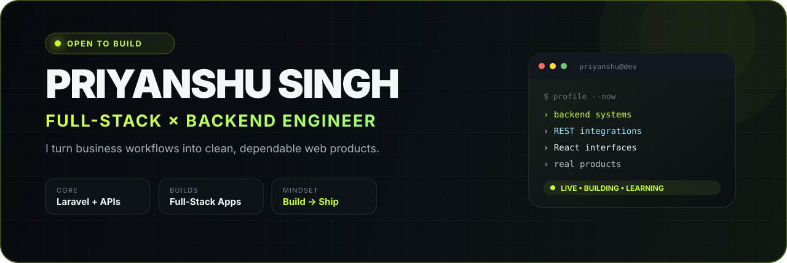
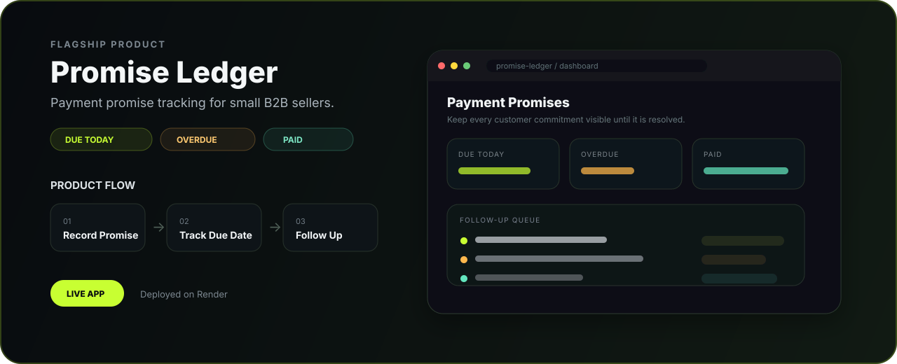

<p align="center">
  <picture>
    <source media="(prefers-color-scheme: dark)" srcset="./assets/hero-v3-dark.svg" />
    <source media="(prefers-color-scheme: light)" srcset="./assets/hero-v3-light.svg" />
    
  </picture>
</p>

<p align="center">
  <a href="https://promise-ledger-priyanshu.onrender.com">
    
  </a>
  <a href="https://portfolio-puce-beta-1chnqgk1s8.vercel.app">
    
  </a>
  <a href="https://www.linkedin.com/in/priyyanshu-singh/">
    
  </a>
  
</p>

<p align="center">
  
</p>

<p align="center">
  <a href="#-flagship-build--promise-ledger">Flagship</a> ·
  <a href="#-project-gallery">Projects</a> ·
  <a href="#-engineering-toolbox">Stack</a> ·
  <a href="#-github-analytics">Analytics</a> ·
  <a href="#-lets-connect">Connect</a>
</p>

---

## 🧑‍💻 Developer Console

<table>
<tr>
<td width="55%" valign="top">

### `> whoami`

```yaml
name: Priyanshu Singh
role: Web Developer @ Infinity Online Solutions
location: Mumbai, India
speciality: Backend-first full-stack development
focus:
  - Laravel & backend systems
  - REST APIs & integrations
  - database-driven applications
  - clean, responsive web interfaces
```

</td>
<td width="45%" valign="top">

### `> status --now`

```text
BUILDING     real web products
LEARNING     Redis + Docker
IMPROVING    API architecture
INTERESTED   backend / full-stack roles
MINDSET      clear > clever
```

</td>
</tr>
</table>

> I like software that solves a real workflow, stays understandable as it grows, and feels simple to the person using it.

---

# ✦ Flagship Build — Promise Ledger

<a href="https://promise-ledger-priyanshu.onrender.com">
  
</a>

<p align="center">
  <a href="https://promise-ledger-priyanshu.onrender.com">
    
  </a>
  
  
</p>

**Promise Ledger** is a focused web product for small B2B sellers who need a clearer way to remember and follow up on customer payment promises.

<table>
<tr>
<td width="33%" valign="top">

### 📅 Promise Tracking
Record a customer’s promised payment date and keep upcoming commitments visible.

</td>
<td width="33%" valign="top">

### ⚠️ Follow-up Queue
Surface **due today** and **overdue** promises so the next action is obvious.

</td>
<td width="33%" valign="top">

### ✅ Resolution History
Update dates, mark payments paid, and keep a useful follow-up trail.

</td>
</tr>
<tr>
<td width="33%" valign="top">

### 📄 CSV Workflow
Import or export customer/payment-promise data for practical day-to-day use.

</td>
<td width="33%" valign="top">

### 💬 WhatsApp Drafts
Prepare manual WhatsApp follow-up wording without auto-sending customer messages.

</td>
<td width="33%" valign="top">

### 🎯 Built for Clarity
The product keeps the interface focused on one question: **who needs a follow-up next?**

</td>
</tr>
</table>

<p align="center"><strong>Customer promise → Due date → Follow-up → Updated status → Paid</strong></p>

---

# 🚀 Project Gallery

<p align="center">
  <a href="https://github.com/priyanshu-ps-dev/priyanshu-portfolio">
    
  </a>
  <a href="https://github.com/priyanshu-ps-dev/realtime-chat">
    
  </a>
</p>

<p align="center">
  <a href="https://github.com/priyanshu-ps-dev/laravel-api-learning">
    
  </a>
  <a href="https://github.com/priyanshu-ps-dev/crud-app-backend">
    
  </a>
</p>

<table>
<tr>
<td width="50%" valign="top">

### 🌐 Developer Portfolio
Modern responsive portfolio for showcasing engineering work and project case studies.

`Next.js` `React` `TypeScript` `CSS`

[Explore repository →](https://github.com/priyanshu-ps-dev/priyanshu-portfolio)

</td>
<td width="50%" valign="top">

### 💬 Realtime Chat
Real-time application project exploring interactive communication flows.

`JavaScript` `WebSockets`

[Explore repository →](https://github.com/priyanshu-ps-dev/realtime-chat)

</td>
</tr>
<tr>
<td width="50%" valign="top">

### 🔌 Laravel API Learning
Backend-focused API design, authentication, validation and Laravel workflows.

`Laravel` `PHP` `REST API`

[Explore repository →](https://github.com/priyanshu-ps-dev/laravel-api-learning)

</td>
<td width="50%" valign="top">

### 🧩 Full-Stack CRUD
React frontend connected to a separate Laravel backend and SQL workflow.

`React` `Laravel` `SQL`

[Frontend →](https://github.com/priyanshu-ps-dev/crud-app-frontend) · [Backend →](https://github.com/priyanshu-ps-dev/crud-app-backend)

</td>
</tr>
</table>

<p align="center">
  <a href="https://github.com/priyanshu-ps-dev?tab=repositories">
    
  </a>
</p>

---

# 🧰 Engineering Toolbox

<table>
<tr>
<td width="50%" valign="top">

### Backend / APIs
<p>
  
</p>

`REST APIs` `Validation` `Authentication` `Integrations`

</td>
<td width="50%" valign="top">

### Frontend / UI
<p>
  
</p>

`Responsive UI` `Component Thinking` `API-driven Screens`

</td>
</tr>
<tr>
<td width="50%" valign="top">

### Data / Infrastructure
<p>
  
</p>

`SQL` `Data Modeling` `Docker` `Caching Concepts`

</td>
<td width="50%" valign="top">

### Workflow / Delivery
<p>
  
</p>

`Git` `Debugging` `Deployment` `Iterative Delivery`

</td>
</tr>
</table>

---

# 🧠 Engineering DNA

<table>
<tr>
<td width="25%" align="center"><strong>01</strong><br/><sub>CLEAR LOGIC</sub><br/><br/>Code should be easy to follow.</td>
<td width="25%" align="center"><strong>02</strong><br/><sub>REAL WORKFLOWS</sub><br/><br/>Build around an actual user action.</td>
<td width="25%" align="center"><strong>03</strong><br/><sub>DEPENDABLE APIs</sub><br/><br/>Predictable inputs, outputs and errors.</td>
<td width="25%" align="center"><strong>04</strong><br/><sub>SHIP + IMPROVE</sub><br/><br/>Deliver, learn, refine, repeat.</td>
</tr>
</table>

```text
DESIGN THE FLOW  →  BUILD THE SYSTEM  →  TEST THE EDGE CASES  →  SHIP  →  LEARN  →  IMPROVE
```

---

# 📊 GitHub Analytics

<p align="center">
  
  
</p>

<p align="center">
  
</p>

<p align="center">
  
</p>

---

# 🎯 Current Build Mode

<p align="center">
  
  
  
  
</p>

---

# 🤝 Let’s Connect

<p align="center">
  <strong>Have a backend, full-stack, web-product or collaboration opportunity?</strong><br/>
  Explore my work, open the live product, or connect with me directly.
</p>

<p align="center">
  <a href="https://promise-ledger-priyanshu.onrender.com">
    
  </a>
  <a href="https://portfolio-puce-beta-1chnqgk1s8.vercel.app">
    
  </a>
  <a href="https://www.linkedin.com/in/priyyanshu-singh/">
    
  </a>
</p>

<p align="center">
  <sub><code>BUILD</code> · <code>TEST</code> · <code>SHIP</code> · <code>IMPROVE</code></sub>
</p>
